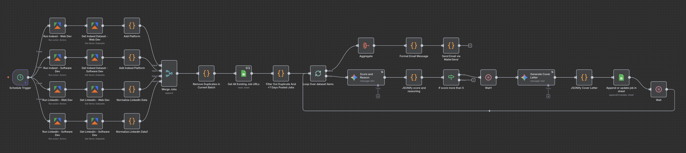
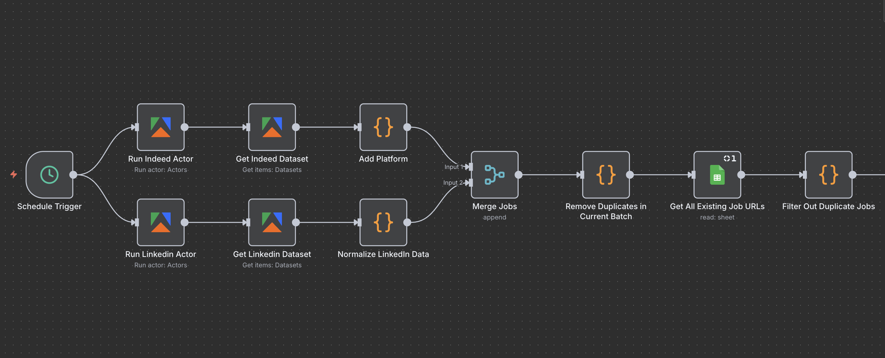
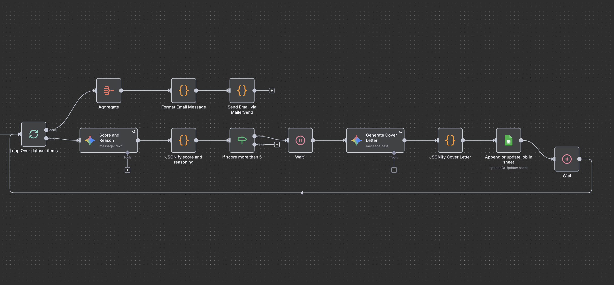
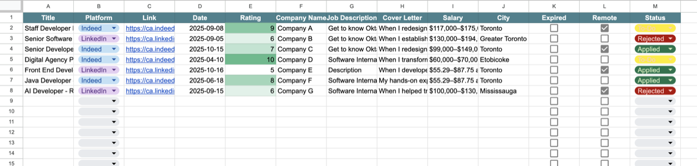

# AI-Powered Job Seeker Automation

Automates job searching on Indeed and LinkedIn using n8n. Scores jobs with AI, generates personalized cover letters, and stores everything in Google Sheets.



## Features

- Scrapes jobs from Indeed and LinkedIn daily
- Removes duplicates to save on API costs (26-69% savings)
- AI scores jobs 0-10 based on resume fit, salary, remote work, and benefits
- Recommends which resume version to use (supports 4 versions)
- Auto-generates cover letters for high-scoring jobs (>5/10)
- Stores all data in Google Sheets with application tracking

## How It Works




```
Schedule Trigger (Daily at 9 AM)
  ├─→ Indeed Actor → Get Dataset → Add Platform ─┐
  └─→ LinkedIn Actor → Get Dataset → Normalize ──┤
                                                   ↓
                                            [MERGE JOBS]
                                                   ↓
                              Remove Duplicates in Current Batch
                                                   ↓
                                  Get All Existing Job URLs
                                                   ↓
                                  Filter Out Duplicate Jobs
                                                   ↓
                                  Loop Over Dataset Items
                                                   ↓
                                    Score and Reason (AI)
                                                   ↓
                                  JSONify Score & Reasoning
                                                   ↓
                                    If Score > 5?
                                        ↓ Yes
                              Generate Cover Letter (AI)
                                        ↓
                              Append to Google Sheets
```

## Setup

**Prerequisites:**

- n8n instance
- Apify account
- Google Gemini API key
- Google Sheets

**Installation:**

1. Clone and import the workflow

   ```bash
   git clone https://github.com/majidseifi/JobSeeker.git
   ```

2. Import `Job Seeker.json` into n8n

3. Add credentials in n8n:

   - Apify API
   - Google Gemini API
   - Google Sheets OAuth2

4. Create a Google Sheet with columns: Title, Platform, Date, Company Name, City, Expired, Remote, Link, Rating, Resume Version, Cover Letter, Salary, Job Description, Status

5. Update these nodes:
   - Search parameters in Indeed/LinkedIn actors
   - Google Sheets document ID
   - Your resume versions in JSONify node

See `SETUP_GUIDE.md` for detailed steps.

## Customization

**Search parameters** - Edit the actor nodes to change location, keywords, or job type

**Scoring criteria** - Modify the "Score and Reason" node:

- Resume fit: 0-4 points
- Salary ($60k+/year): 0-2 points
- Remote: 0-2 points
- Benefits: 0-1 point
- Full-time: 0-1 point

**Cover letter style** - Edit the "Generate Cover Letter" node prompt

## Output



All jobs saved with AI rating, recommended resume version, and personalized cover letters for top matches.

## Performance

With 100 jobs/day:

- ~23 duplicates filtered
- ~77 unique jobs scored
- ~38 cover letters generated
- Saves ~26% on AI costs

## Author

**YOUR_FULL_NAME**

- Website: [yourdomain.com](https://yourdomain.com)
- LinkedIn: [linkedin.com/in/your-profile](https://linkedin.com/in/your-profile)
- Email: majid@yourdomain.com

## Disclaimer

This tool is for personal use. Be mindful of web scraping terms of service, API rate limits and costs, and data privacy when storing job information. Use responsibly and in accordance with all applicable terms of service and local laws.
